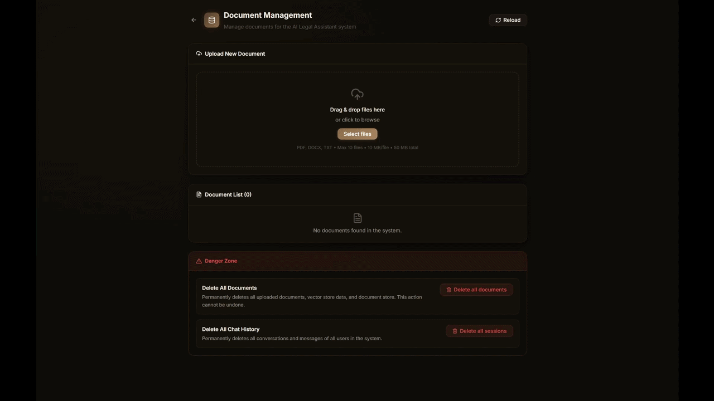

<div align="center">

# Local RAG Assistant

### A private, source-grounded, and highly customizable AI platform

[](https://react.dev/)
[](https://fastapi.tiangolo.com/)
[](https://www.llamaindex.ai/)
[](https://ollama.com/)
[](https://qdrant.tech/)
[](https://www.docker.com/)
[](https://opensource.org/licenses/MIT)

*Your personal, offline-capable AI brain. Feed it documents, ask questions, and get precise, cited answers.*


[English](#english) | [Tiếng Việt](#tiếng-việt)

</div>

---

# English

## 🌟 Overview

**Local RAG Assistant** is a full-stack, 100% private Retrieval-Augmented Generation (RAG) platform. It empowers you to interact with your documents using local AI models, ensuring your sensitive data never leaves your machine. 

Designed with a domain-agnostic architecture, it is ready to be utilized out-of-the-box or easily customized for specific knowledge bases—be it legal, medical, financial, IT, or personal research.

## ✨ Key Features

- 🧠 **100% Local & Private**: Powered by Ollama and Qdrant. No third-party API keys, no data leaks. Your files and chats remain strictly on your infrastructure.
- 📄 **Smart Document Processing**: Automatic OCR for scanned PDFs using Tesseract, with optimized text extraction for complex documents and multiple languages.
- ⚡ **Advanced RAG Architecture**: Utilizes LlamaIndex's `AutoMergingRetriever` for hierarchical context reconstruction, ensuring the AI comprehends broader contexts rather than fragmented sentences.
- 💬 **Real-time Streaming UX**: Smooth Server-Sent Events (SSE) streaming for a responsive and natural chat experience.
- 🔍 **Interactive Citations**: Answers are backed by clickable source cards. Clicking a source instantly opens the integrated PDF viewer, automatically scrolling to the exact cited page.
- 🛡️ **Enterprise-grade Security & Reliability**: Robust authentication via HttpOnly JWT cookies, CSRF protection, role-based access control, rate limiting, and reliable background document ingestion using Redis Queue.
- 🌐 **Multilingual Interface**: Instantly toggle between English and Vietnamese UI.

> [!IMPORTANT]
> AI-generated answers can be incomplete or incorrect. Always validate important
> conclusions against authoritative sources and add domain-specific safeguards
> before using the system in high-stakes environments.

## ⚙️ Core Capabilities

### User Experience
- Secure account registration, login, and multi-device session management.
- Multi-session chat with persistent conversation history and auto-generated titles.
- Markdown and GitHub-Flavored Markdown rendering.
- Responsive desktop and mobile interface.

### RAG and Document Processing
- Supports PDF, DOCX, and UTF-8 TXT uploads.
- Hierarchical chunking of documents to preserve logical structures.
- Local Hugging Face embeddings with automatic GPU/CPU device detection.
- Cross-process retriever cache management to ensure the vector index is always up-to-date and consistent.
- Conversation context awareness leveraging recent chat history.

### Administration & Management
- Role-protected dashboard for document and user management.
- Drag-and-drop multi-file upload with background ingestion tracking.
- Secure source file access and destructive bulk operations protected by admin verification.

## 💻 Technology Stack

| Layer | Technologies |
|---|---|
| **Frontend** | React 19, TypeScript, Vite, React Router, React Markdown, Tailwind CSS (optional) |
| **Backend API** | FastAPI, Pydantic, SQLAlchemy |
| **RAG Engine** | LlamaIndex, Auto-Merging Retrieval |
| **LLM Inference** | Ollama (Default: `qwen2.5:7b`) |
| **Embeddings** | Sentence Transformers (Default: `dangvantuan/vietnamese-document-embedding`) |
| **Vector Database** | Qdrant |
| **Database** | SQLite (Default), SQLAlchemy-compatible databases |
| **Queue & Cache** | Redis, RQ (Redis Queue) |
| **Document Parsing** | PyMuPDF, LlamaIndex file readers, Tesseract OCR |
| **Deployment** | Docker, Docker Compose, Nginx |

## 🚀 Quick Start

### Prerequisites
- Docker Desktop or Docker Engine + Docker Compose.
- NVIDIA GPU (Recommended) + NVIDIA Container Toolkit for fast inference.

### 1. Configure the Environment
Clone the repository and set up your environment variables:
```bash
git clone https://github.com/yourusername/local-rag-assistant.git
cd local-rag-assistant
cp .env.example .env
```
Open `.env` and configure your secure credentials:
- `JWT_SECRET_KEY`: Generate a secure random string.
- `SUPER_ADMIN_USERNAME` & `SUPER_ADMIN_PASSWORD`: Your credentials for the admin dashboard.

### 2. Launch the Stack
```bash
docker compose up --build -d
```
Once the containers are healthy, open `http://localhost:3000` in your browser.



## 🛠️ Customization Notes (For Developers)

This project is built to be yours. Here is how you can tweak it:

1. **Change the LLM**: Open `.env` and change `OLLAMA_MODEL=qwen2.5:7b` to your preferred model (e.g., `llama3`, `mistral`). Ensure you have pulled it in Ollama.
2. **Change the Embedding Model**: Update `EMBEDDING_MODEL` in `.env`. For English-centric use cases, consider `BAAI/bge-small-en-v1.5`.
3. **Change the AI Persona**: Head over to `backend/app/services/session_service.py` and modify the system prompts. You can easily adapt the assistant for specific domains.
4. **Change OCR Language**: The `Dockerfile` in the `backend/` directory installs `tesseract-ocr-vie`. Modify this to support other languages depending on your document language.

---

# Tiếng Việt

## 🌟 Tổng quan

**Local RAG Assistant** là một nền tảng Hỏi-Đáp tài liệu thông minh (RAG) toàn diện, được thiết kế với tiêu chí bảo mật 100%. Hệ thống cho phép bạn trò chuyện với kho tài liệu của mình thông qua các mô hình AI chạy cục bộ, đảm bảo dữ liệu nhạy cảm không bao giờ bị lộ lọt ra bên ngoài.

Với kiến trúc độc lập và linh hoạt, dự án sẵn sàng để sử dụng ngay hoặc dễ dàng tùy biến cho các cơ sở tri thức chuyên biệt như pháp lý, y tế, tài chính, IT, hoặc nghiên cứu cá nhân.

## ✨ Tính năng Nổi bật

- 🧠 **Chạy Local & Riêng tư 100%**: Sức mạnh từ Ollama và Qdrant. Không cần API key của bên thứ ba, toàn bộ dữ liệu nằm an toàn trên hạ tầng của bạn.
- 📄 **Xử lý Tài liệu Thông minh**: Tự động nhận diện OCR cho các file PDF dạng ảnh bằng Tesseract, trích xuất văn bản hiệu quả cho các tài liệu phức tạp.
- ⚡ **Kiến trúc RAG Tiên tiến**: Sử dụng `AutoMergingRetriever` của LlamaIndex để tái tạo ngữ cảnh theo phân cấp, giúp AI hiểu được bức tranh toàn cảnh thay vì các câu văn rời rạc.
- 💬 **Trải nghiệm Chat Mượt mà**: Phản hồi theo thời gian thực (Streaming SSE) mang lại trải nghiệm tương tác tự nhiên, mượt mà.
- 🔍 **Trích dẫn Tương tác**: Câu trả lời đi kèm thẻ Nguồn minh bạch. Click vào nguồn sẽ mở trình xem PDF tích hợp và tự động cuộn đến đúng trang được trích dẫn.
- 🛡️ **Bảo mật & Ổn định cấp Doanh nghiệp**: Xác thực JWT an toàn, chống CSRF, phân quyền truy cập, giới hạn tốc độ (rate limit), và xử lý tác vụ nền ổn định với Redis Queue.
- 🌐 **Giao diện Đa ngôn ngữ**: Chuyển đổi tức thì giữa Tiếng Anh và Tiếng Việt.

## ⚙️ Khả năng Cốt lõi

### Trải nghiệm Người dùng
- Quản lý tài khoản, đăng nhập an toàn và kiểm soát phiên bản trên nhiều thiết bị.
- Hỗ trợ nhiều phiên chat, tự động tạo tiêu đề và lưu lịch sử trò chuyện.
- Hiển thị Markdown tiêu chuẩn chuẩn xác.
- Thiết kế đáp ứng (Responsive) thân thiện cho cả desktop và thiết bị di động.

### RAG và Xử lý Tài liệu
- Hỗ trợ upload các định dạng PDF, DOCX, và TXT.
- Phân chia văn bản (chunking) theo cấu trúc để giữ nguyên mạch ý nghĩa.
- Sử dụng mô hình embedding cục bộ (Hugging Face) với khả năng tự động nhận diện GPU/CPU.
- Quản lý bộ đệm (cache) retriever hiệu quả, đảm bảo cơ sở dữ liệu vector luôn được đồng bộ.
- Nhận thức ngữ cảnh hội thoại dựa trên các tin nhắn gần nhất.

### Quản trị & Vận hành
- Trang quản trị (Admin) bảo mật để quản lý tài liệu và người dùng.
- Kéo thả upload nhiều file cùng lúc với thanh theo dõi tiến trình xử lý ngầm.
- Quản lý danh sách tài liệu và các thao tác xóa, cập nhật được bảo vệ bằng xác minh quản trị viên.

## 🚀 Hướng dẫn Triển khai

### Yêu cầu hệ thống
- Docker Desktop hoặc Docker Engine + Docker Compose.
- Card đồ họa NVIDIA (Khuyên dùng) + NVIDIA Container Toolkit để AI phản hồi nhanh.

### 1. Cấu hình Môi trường
Clone dự án và thiết lập file môi trường:
```bash
git clone https://github.com/yourusername/local-rag-assistant.git
cd local-rag-assistant
cp .env.example .env
```
Mở file `.env` và thiết lập các biến bảo mật:
- `JWT_SECRET_KEY`: Thay bằng một chuỗi ngẫu nhiên, độ dài cao.
- `SUPER_ADMIN_USERNAME` & `SUPER_ADMIN_PASSWORD`: Tài khoản quản trị để truy cập Admin Dashboard.

### 2. Khởi động Hệ thống
```bash
docker compose up --build -d
```
Sau khi các container báo trạng thái `healthy`, truy cập `http://localhost:3000` trên trình duyệt của bạn.

## 🛠️ Tùy biến Cá nhân (Dành cho Lập trình viên)

Dự án này là của bạn. Dưới đây là các cách tinh chỉnh hệ thống:

1. **Đổi LLM (Mô hình AI)**: Mở `.env` và sửa `OLLAMA_MODEL=qwen2.5:7b` thành mô hình bạn muốn dùng (VD: `llama3`, `mistral`). Đảm bảo đã pull model đó qua Ollama.
2. **Đổi Mô hình Embedding**: Cập cả biến `EMBEDDING_MODEL` trong `.env`. Mặc định dùng `dangvantuan/vietnamese-document-embedding` tối ưu cho tiếng Việt. Với tiếng Anh, bạn có thể thử `BAAI/bge-small-en-v1.5`.
3. **Đổi "Tính cách" AI**: Mở file `backend/app/services/session_service.py` và tinh chỉnh system prompt để chuyển đổi thành trợ lý y tế, lập trình, v.v.
4. **Thay đổi ngôn ngữ OCR**: File `Dockerfile` trong thư mục `backend/` đang cài đặt `tesseract-ocr-vie`. Bạn có thể thay đổi để hỗ trợ thêm các ngôn ngữ khác tùy theo loại tài liệu bạn sử dụng.

---

> **Lưu ý**: Đây là một dự án mã nguồn mở sử dụng giấy phép MIT. Bạn hoàn toàn có thể tự do sao chép (Fork) và chỉnh sửa hệ thống để phục vụ cho mục đích nghiên cứu và thương mại của riêng mình.
